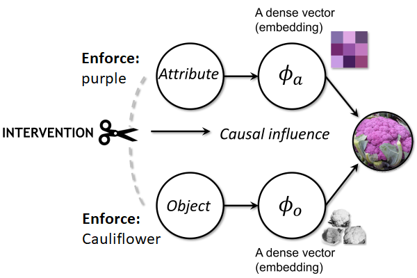
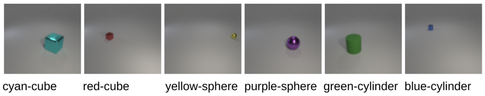

# A causal view of compositional zero-shot recognition
This repository hosts the dataset and source code for the paper "A causal view of compositional zero-shot recognition". Yuval Atzmon, Felix Kreuk, Uri Shalit, Gal Chechik, NeurIPS 2020 (Spotlight)

## AO-CLEVr Dataset

AO-CLEVr is a new synthetic-images dataset containing images of "easy" Attribute-Object categories, based on the CLEVr framework (Johnson et al. CVPR 2017). AO-CLEVr has attribute-object pairs created from 8 attributes: \{ red, purple, yellow, blue, green, cyan, gray, brown \} and 3 object shapes \{sphere, cube, cylinder\}, yielding 24 attribute-object pairs. Each pair consists of 7500 images. Each image has a single object that consists of the attribute-object pair. The object is randomly assigned one of two sizes (small/large), one of two materials (rubber/metallic), a random position, and random lightning according to CLEVr defaults. 

The dataset can be downloaded from [the following url](https://drive.google.com/drive/folders/1BBwW9VqzROgJXmvnfXcOxbLob8FB_jLf).

## Code 
(Under construction)

## Cite the paper
If you use the contents of this project, please cite our paper.

    @inproceedings{neurips2020_causal_comp_atzmon,
     author = {Atzmon, Yuval and Kreuk, Felix and Shalit, Uri and Chechik, Gal},
     booktitle = {Advances in Neural Information Processing Systems (NeurIPS)},
     title = {A causal view of compositional zero-shot recognition},
     year = {2020}
    }
